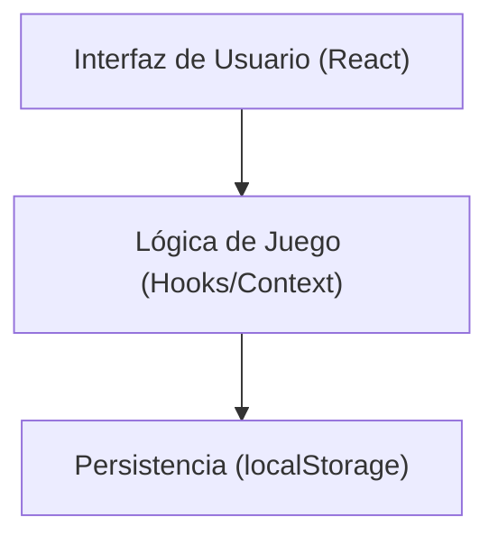

# Tetris – Documentación de Requisitos y Planificación

## 1. Requisitos del Producto

### Requisitos Funcionales
- RF1. El usuario puede iniciar una nueva partida de Tetris.
- RF2. El usuario puede mover las piezas (izquierda, derecha, abajo) y rotarlas.
- RF3. Las piezas caen automáticamente a intervalos regulares.
- RF4. Cuando una línea se completa, desaparece y suma puntos.
- RF5. El juego termina cuando las piezas alcanzan la parte superior del tablero.
- RF6. Se muestra la puntuación actual y la mejor puntuación.
- RF7. El usuario puede pausar y reanudar la partida.
- RF8. El usuario puede reiniciar la partida en cualquier momento.
- RF9. El sistema muestra la siguiente pieza que aparecerá.

### Requisitos No Funcionales
- RNF1. Interfaz intuitiva, accesible y responsiva.
- RNF2. Compatible con navegadores modernos.
- RNF3. Código limpio, modular y documentado.
- RNF4. Dockerizable y fácil de desplegar.
- RNF5. Sin información sensible en frontend.
- RNF6. Fluidez mínima de 30 FPS.
- RNF7. Fácilmente testeable (unit tests y E2E).

### Restricciones
- Solo frontend (React + TypeScript). Sin backend ni base de datos.
- Mejor puntuación en localStorage.
- Diseño minimalista y accesible (WCAG AA).

### Criterios de Aceptación
- El usuario puede jugar una partida completa sin errores.
- El sistema responde correctamente a las acciones del usuario.
- El juego es visualmente claro y accesible.
- El despliegue en Docker y Vercel funciona correctamente.

---

## 2. Análisis de Usuarios

### Perfiles de Usuario
- Jugador casual
- Desarrollador/estudiante
- Tester

### User Stories
- Como jugador, quiero mover y rotar piezas para completar líneas y obtener la mayor puntuación posible.
- Como usuario, quiero pausar y reanudar el juego para no perder mi progreso si me interrumpen.
- Como usuario, quiero ver mi mejor puntuación para superarme.
- Como desarrollador, quiero que el código sea claro y modular para poder modificarlo o extenderlo fácilmente.

---

## 3. Diseño Técnico

### Arquitectura del Sistema
- Frontend: React + TypeScript (Vite)
- Gestión de estado: React Context o useReducer
- Persistencia local: localStorage para la mejor puntuación
- Testing: Jest (unitario), Cypress (E2E)
- Dockerización: Dockerfile y docker-compose

#### Diagrama de Componentes



#### Flujo de Datos
1. El usuario interactúa con la UI (teclado/botones).
2. La UI envía eventos a la lógica de juego.
3. La lógica actualiza el estado y la UI se re-renderiza.
4. Al finalizar la partida, se actualiza la mejor puntuación en localStorage.

### Especificaciones de Base de Datos
- No aplica (solo localStorage para bestScore):
  - Clave: `tetris_best_score`
  - Valor: número entero

### Diseño de API
- No aplica (aplicación 100% frontend).

---

## 4. Aspectos Técnicos

### Stack Tecnológico
- Lenguaje: TypeScript
- Framework: React (Vite)
- Estilos: CSS Modules o TailwindCSS (opcional)
- Testing: Jest, React Testing Library, Cypress
- Contenedores: Docker, Docker Compose

### Consideraciones de Seguridad
- No almacenar datos sensibles.
- Validar y sanitizar entradas del usuario (teclado).
- Cumplir buenas prácticas OWASP para frontend.
- Limitar acceso a localStorage solo a la mejor puntuación.

### Plan de Testing
- Unitarias: Lógica de movimiento, rotación y eliminación de líneas.
- Integración: Interacción entre componentes y lógica.
- E2E: Flujo completo de juego, desde inicio hasta game over.
- Cobertura: Mínimo 80% de statements y branches.

---

## 5. Operaciones

### Estrategia de Despliegue
- Entornos:
  - Desarrollo: Docker Compose, hot reload.
  - Producción: Docker Compose, build optimizado.
  - Vercel: Deploy automático desde GitHub.
- Monitoreo: Logs de consola y errores en producción.

### Estimaciones y Cronograma
| Fase                        | Duración estimada |
|-----------------------------|------------------|
| Documentación y análisis    | 1 día            |
| Estructura y setup inicial  | 0.5 días         |
| Lógica de juego             | 1 día            |
| UI y controles              | 1 día            |
| Testing                     | 0.5 días         |
| Dockerización y despliegue  | 0.5 días         |
| **Total**                   | **4.5 días**     |

**Hitos:**
- H1: Documentación completa y validada
- H2: Setup y estructura base funcional
- H3: Juego jugable y estable
- H4: Pruebas y cobertura aceptable
- H5: Despliegue en producción

---

# React + TypeScript + Vite

This template provides a minimal setup to get React working in Vite with HMR and some ESLint rules.

Currently, two official plugins are available:

- [@vitejs/plugin-react](https://github.com/vitejs/vite-plugin-react/blob/main/packages/plugin-react) uses [Babel](https://babeljs.io/) for Fast Refresh
- [@vitejs/plugin-react-swc](https://github.com/vitejs/vite-plugin-react/blob/main/packages/plugin-react-swc) uses [SWC](https://swc.rs/) for Fast Refresh

## Expanding the ESLint configuration

If you are developing a production application, we recommend updating the configuration to enable type-aware lint rules:

```js
export default tseslint.config([
  globalIgnores(['dist']),
  {
    files: ['**/*.{ts,tsx}'],
    extends: [
      // Other configs...

      // Remove tseslint.configs.recommended and replace with this
      ...tseslint.configs.recommendedTypeChecked,
      // Alternatively, use this for stricter rules
      ...tseslint.configs.strictTypeChecked,
      // Optionally, add this for stylistic rules
      ...tseslint.configs.stylisticTypeChecked,

      // Other configs...
    ],
    languageOptions: {
      parserOptions: {
        project: ['./tsconfig.node.json', './tsconfig.app.json'],
        tsconfigRootDir: import.meta.dirname,
      },
      // other options...
    },
  },
])
```

You can also install [eslint-plugin-react-x](https://github.com/Rel1cx/eslint-react/tree/main/packages/plugins/eslint-plugin-react-x) and [eslint-plugin-react-dom](https://github.com/Rel1cx/eslint-react/tree/main/packages/plugins/eslint-plugin-react-dom) for React-specific lint rules:

```js
// eslint.config.js
import reactX from 'eslint-plugin-react-x'
import reactDom from 'eslint-plugin-react-dom'

export default tseslint.config([
  globalIgnores(['dist']),
  {
    files: ['**/*.{ts,tsx}'],
    extends: [
      // Other configs...
      // Enable lint rules for React
      reactX.configs['recommended-typescript'],
      // Enable lint rules for React DOM
      reactDom.configs.recommended,
    ],
    languageOptions: {
      parserOptions: {
        project: ['./tsconfig.node.json', './tsconfig.app.json'],
        tsconfigRootDir: import.meta.dirname,
      },
      // other options...
    },
  },
])
```
